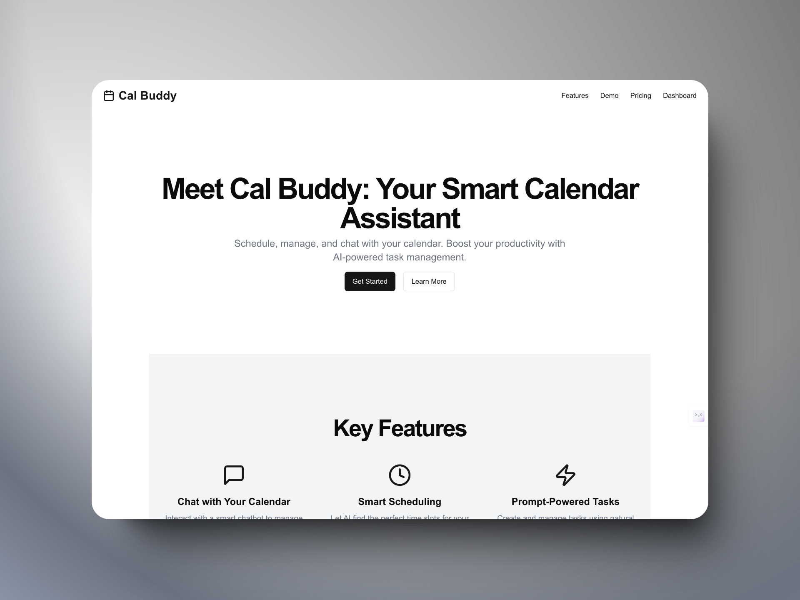
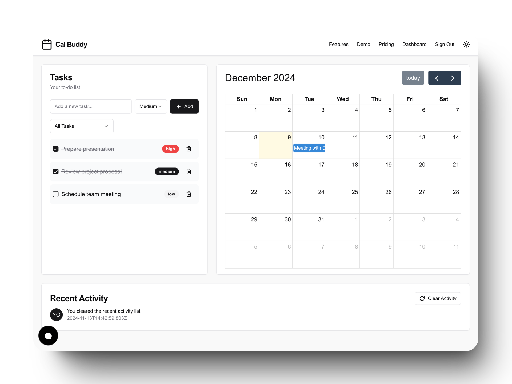
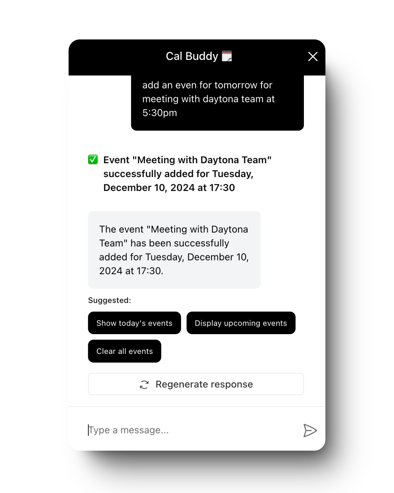

# Cal Buddy

[Cal Buddy](https://cal-buddy.vercel.app/) is a smart calendar assistant that helps you schedule, manage, and chat with your calendar. It helps you boost your productivity with AI-powered task management that synchronizes seamlessly with your calendar.

---

## 🚀 Getting Started

### Open Using Daytona

1. **Install Daytona**: Follow the [Daytona installation guide](https://www.daytona.io/docs/installation/installation/).
2. **Create the Workspace**:

   ```bash
   daytona create https://github.com/daytonaio/sample-calendar-buddy
   ```

3. Create a `.env.local` file in the root directory and add the following content:

```
GROQ_API_KEY=<GROQ_API_KEY>
NEXT_PUBLIC_GOOGLE_CALENDAR_API_KEY=<GOOGLE_CALENDAR_API_KEY>
NEXT_PUBLIC_APPWRITE_PROJECT_ID=<APPWRITE_PROJECT_ID>
```

Replace `<GROQ_API_KEY>`, `<GOOGLE_CALENDAR_API_KEY>`, `<APPWRITE_PROJECT_ID>`, and `<SITE_URL>` with your actual values.

4. **Start the Application**:
   ```bash
   npm run dev
   ```
   The application will be available at http://localhost:3000.

---

## ✨ Features

- 📅 Smart calendar management
- 🤖 AI-powered task scheduling
- 💬 Chat interface for easy interaction
- 📊 Productivity tracking and insights
- 🔗 Integration with popular calendar services

## 💻 Technologies Used

- [](https://nextjs.org/)
- [](https://github.com/features/copilot)
- [](https://tailwindcss.com/)
- [](https://ui.shadcn.com/)
- [](https://appwrite.io/)
- [](https://groq.netlify.app/)
- [](https://www.docker.com/)

## 📸 Screenshots




